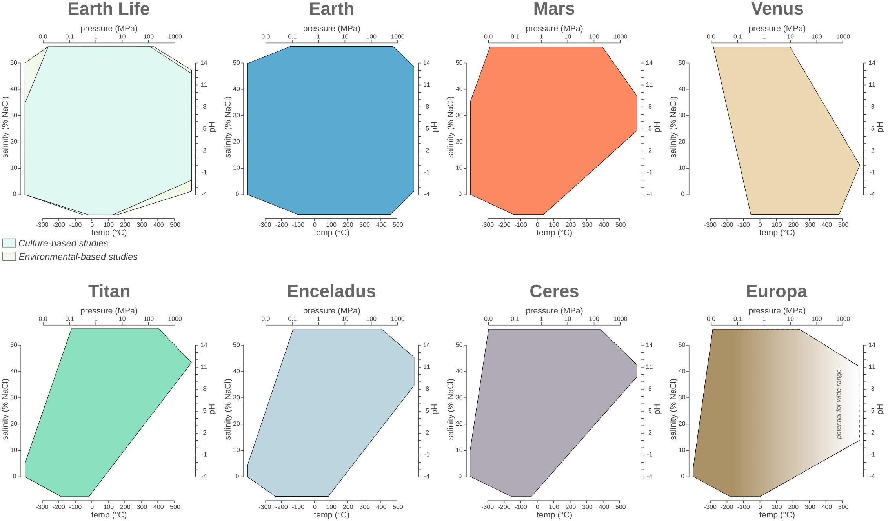
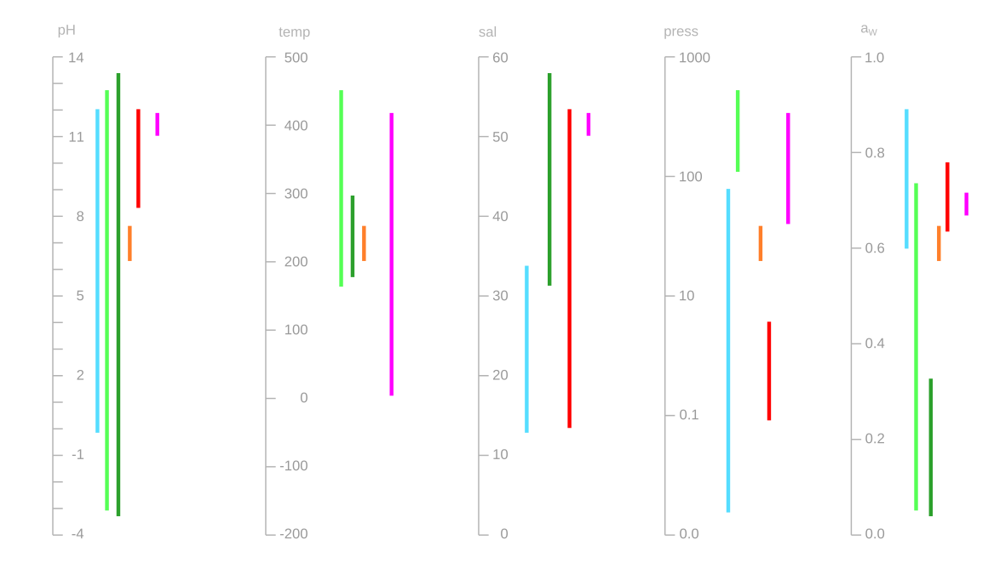
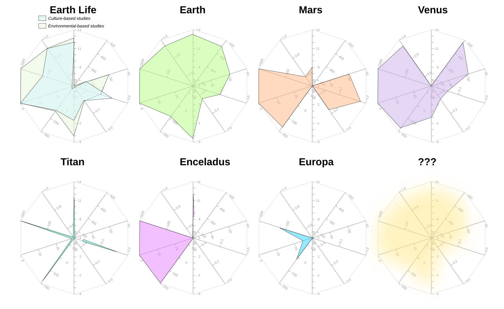
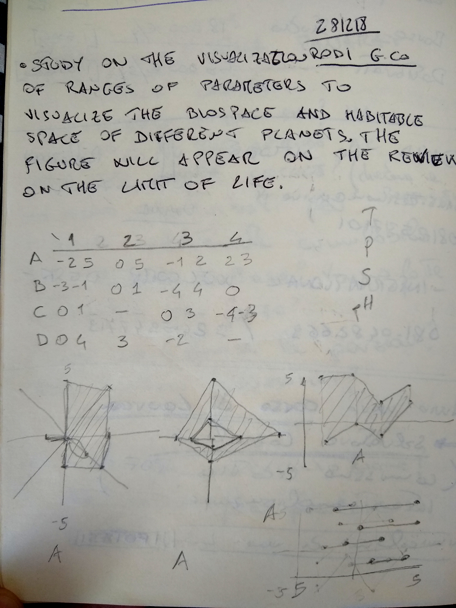
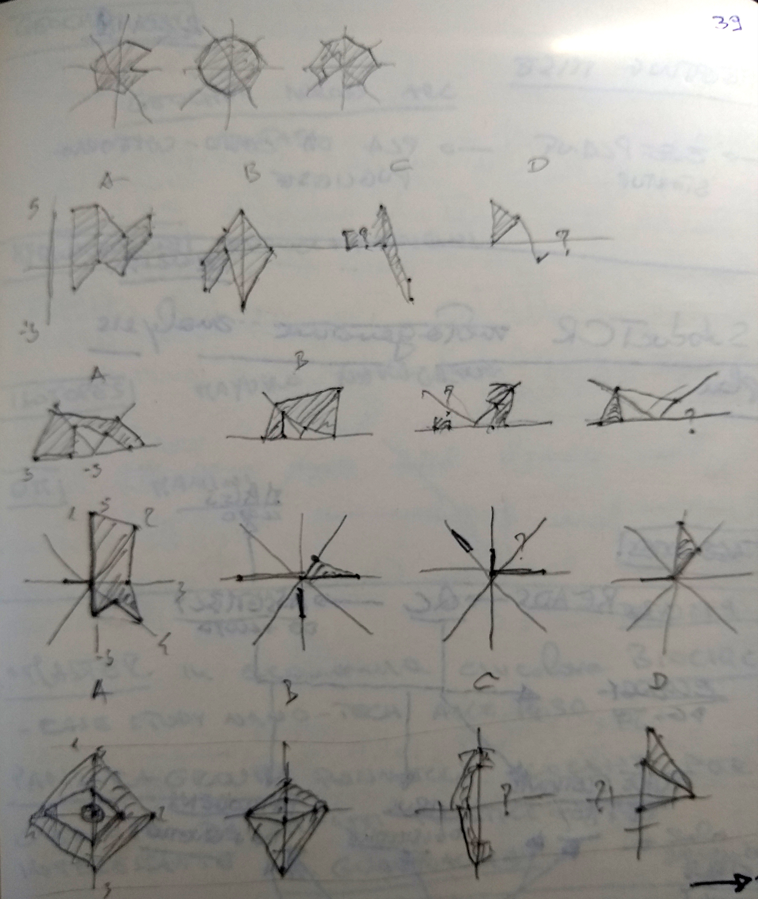
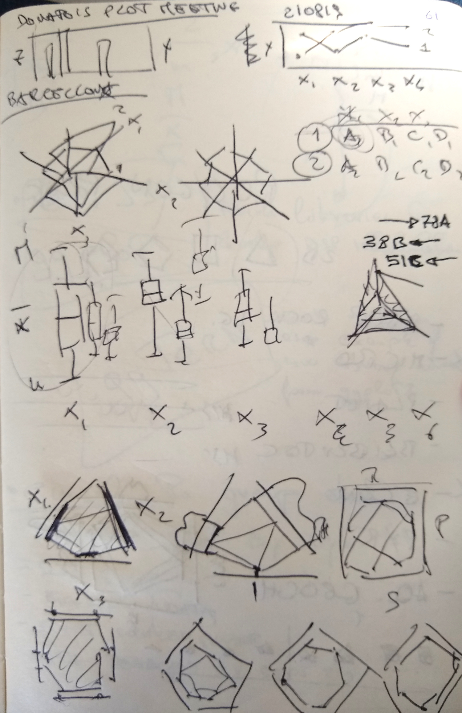
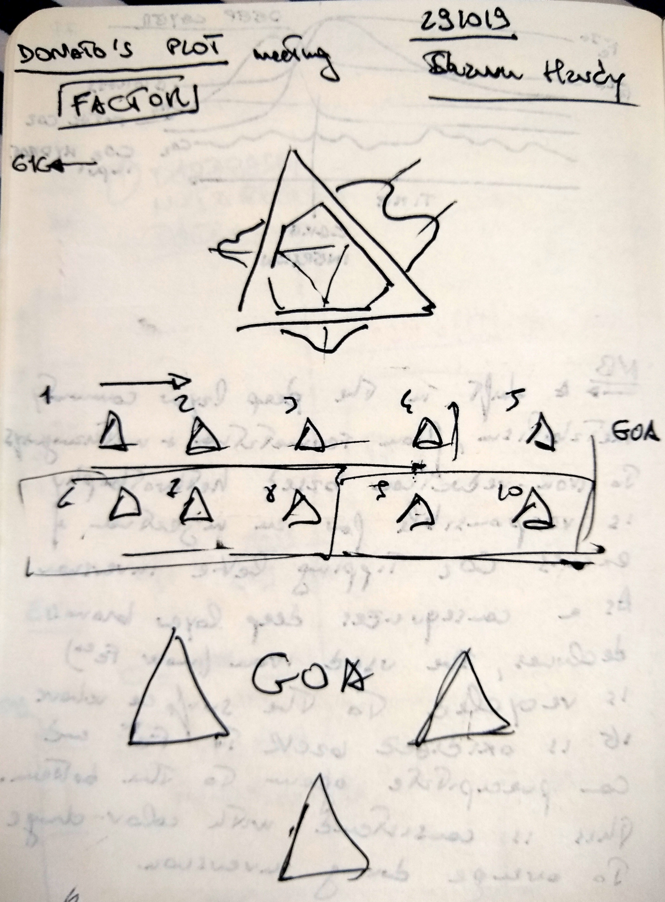
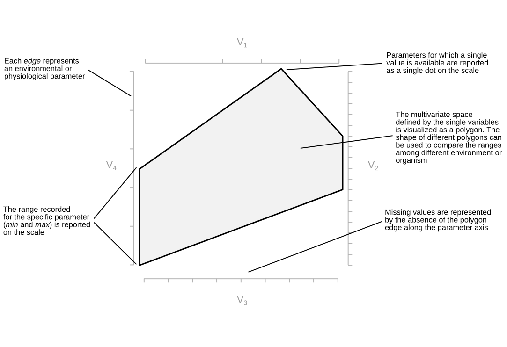

# Polygons Plot

Written by:</em> Donato Giovannelli

In case you have not had enough plot and chart types, here come a new one: the Polygon plot. A Polygon plot [_singular_, Polygons plot, _plural_] is designed to visualize multivariate ranges as opposite to single data points. I have developed the concept for the polygons plot in late 2018 while working on our review [Living at the Extremes: Extremophiles and the Limits of Life in a Planetary Context](https://www.frontiersin.org/articles/10.3389/fmicb.2019.00780/full), published in 2019 in Frontiers in Microbiology.

While working on the review, I started collecting data regarding the range (minimum and maximum) for physico-chemical parameters of Earth's life such as pH, temperature, salinity and pressure. I wanted to visualize the ranges of these variables in a single plot, but I could not find a simple way to do it. After some research and a lot of doodling, the polygons plot was born!

>The first polygons plot appeared in [Merino et al. 2019 Frontiers in Microbiology](https://www.frontiersin.org/articles/10.3389/fmicb.2019.00780/full). If you find the plot interesting or useful, consider citing the Merino et al. 2019 paper. More information about how to cite the Polygon plot are available at the section [how to cite](#how-to-cite-the-polygon-plot)

### Polygon plot features

Polygon plot have many features that makes them unique and convenient to show multivariate ranges and a number of statistical properties.

- It is possible to plot from 3 to 6 variable in a single 2D plot (potentially more, depending of big your final plot will be)
- The showed range can be the interval minimum-maximum, interquartile range or any other interval
- You can add the mean (arithmetic, geometric, etc...) as a single line running through the plot
- You can easily use the shape of the polygon plot to categorize you observations into discrete groups having a similar multivariate distribution of the ranges for the selected variables
- Soon(ish) you'll be able to plot the boxplot or density plot on the outside of each axis
- You can use the perimeter of the axis projection or the area of the polygon to sort you polygons plot array or query your visualization based on extension of the range of variables visualized

>**A word of caution:** While it defines a space on a plane that can be used for algebraic operations to work on a series of plots (called a polygons plot array), it does not define the state space of the possible combinations of the visualized variables. Visualizing the polygon plot as the state space of possible instances might seem like an intuitive thing to do, but it is inherently **_wrong_**! You are have been warned!

We are working on a R package to be able to make Polygons plot easily and add some of the functionalities we have imagined discussing these plots with Shaunna Morrison, Fang Huang and Anirudh Prabhu. For now, we have a _beta_ Shiny app built by [Fang Huang](https://people.csiro.au/H/F/f-huang) than can be used right now to create Polygons plot and download them as **.png** or **.svg**. You can find the _beta_ of the app here: [fanghuang.shinyapps.io/DonatoPlot/](https://fanghuang.shinyapps.io/DonatoPlot/).

>Fun fact! My friends refer to these plots as "Donato's plots"!

Keep reading to find out how to use and read polygons plot, how they were invented and how they stack against other popular choices for plotting multivariate data. Or just jump ahead to the section you are most interest in!

- [The inception](#the-inception)
- [Reading the Polygon plot](#reading-the-polygon-plot)
- [Using the Polygon plot: the Shiny app](#using-the-plot-the-shiny-app)
- [Polygons plot array](#polygons-plot-array)
- [List of future features](#list-of-future-features)
- [How to cite the Polygon plot](#how-to-cite-the-polygon-plot)
- [Questions, support and contribute!](#questions-support-and-contribute)
- [Gallery of Polygons](#gallery-of-polygons)

### The inception
While working on the review I started trying to put on the same plot multiple ranges of variables. The first choice was to use multiple [boxplots](https://en.wikipedia.org/wiki/Box_plot). But while they are very robust and well known, it was difficult to portray the kind of information I was looking for. Boxplot had to be grouped by variable, making across variable comparison difficult, or by group, making across group comparison difficult. A lot of boxplots were required to put all the variable together, with way to much ink on the page. Messy. I did not like it.

<!--  -->
>My planetary and life data used for the Merino et al. 2019 paper visualized as a boxplots.

Searching the web I found [forest plot](https://en.wikipedia.org/wiki/Forest_plot), which in essence are a simplified form of bloxplot were the range is represented by a single line. The result is a series of parallel line (thus reducing the amount of ink, but also the amount of information reported) essentially suffering the same problems of the boxplot.

>The same data as above visualized as a Forest plot.

The type of comparison I was looking for was similar to the information displayed by a [spider chart](https://en.wikipedia.org/wiki/Radar_chart) (called also polar chart, radar chart or star plot among many other names). While not one of my favorite, spider chart are useful to visualize multivariate data in a single plot, and give more intuitive comparison of the distribution of the data among different variables between different plots. The problem arises when for each variable you don't want just to plot a single value, but you want to show the data range (like minimum and maximum), or a combination of range and average.

>The same data as above plotted as spider plots plot. Ranges are difficult to visualize and sometimes impossible to plot, depending on the variable's order.

I started doodling through a series of option, and devising a series of rules. Soon I started converging on the idea that polygons were the best solution to visualize ranges for n-variables.

### Reading the Polygon plot
Reading a polygon plot is easy. The plot has 3 to 6 axis representing the different variables to be visualized. The range (for example minimum-maximum values) are plotted as a segment parallel to its corresponding axis. The different segments are linked together to form a polygon. The resulting polygon might have up to 2x the variable number. This is due to an arbitrary space inserted between the different axis to improve readability and avoid plotting artifacts (called offset). Single values are plotted as a point (vertex), while missing value are represented by a missing edge on the data polygon. The multivariate space is defined by the resulting polygon. The mean for each variable can be represented by a single point and connected by a line.

> **A word of caution**: The multivariate space defined in the 2D plane by the polygon plot does not define the state space of the possible combinations of the visualized variables. Thinking of the polygon plot as the state space of possible instances might seem like an intuitive thing to do, but it is inherently _**wrong**_! You are have been warned!  

>Anatomy of a polygon plot, with all the main characteristic explained.

### Using the Polygon plots: the Shiny app
While we are working toward a R package to be able to use polygon plots and their functionalities ([Help us by contributing!](#questions-support-and-contribute)), [Fang Huang](https://people.csiro.au/H/F/f-huang) has built a Shiny app than can be used to create Polygons plot. The resulting plots can be download as **.png** or **.svg**. You can find the _beta_ of the app here: [fanghuang.shinyapps.io/DonatoPlot/](https://fanghuang.shinyapps.io/DonatoPlot/).

Data can be provided as .csv file to the app in one of three ways (also mixing them in the same data file):

> Table of the formats that can be provided to the polygon plot app

|--|--|--|--|

You can find an  example of the format in the app. Once you have uploaded the data file you can progress to step 2 and make you polygon plot. The Shiny app allows you to make only one plot at the time, but it has a nice number of functionalities. You can selected the variable number, you can select the offset, map different variables to the axis of your choice and vary aesthetics of the plot. Once you are done download the plot in your favorite format!

### Polygons plot array
Combining more than one polygon plot will give you what we call a polygons plot array. So far we have been using this term to refer to polygons plot that have 6+ plots, but this is totally arbitrary. Polygons plot array give you an excellent way to compare the range of a multivariate space across different sample/sites/observations very quickly. Our brain is very good in distinguishing different shapes, and pattern can be recognized quickly.

> An example of a polygons plot array sorted by area of the polygon.

In polygons plot array the only rule to make it worthwhile is to keep the order, type, number and scale of the variables constant across all the different plots. Once you have the array you can potentially ask (and will be able to in the R package) questions based on simple geometric calculations. For example you can sort your plots based on the perimeter or the area of the polygon. You can use skewness or symmetries to sort your plots. We think in the future we will use image recognition to identify specific characteristics of the plot to classify it in the multivariate space.

### List of future features
Here an overgrowing list of possible features to be included in the R packages we are developing. We periodically update the list based on the feature request on GitHub, but head there for complete list. Also, consider contributing if you know how to code!

- Plotting different basic statistics (mean, mode, median, interquartile range)
- Adding boxplots or density functions on the outside of each axis
- Directly plot a polygons plot array
- versatility in removing plot aesthetics for versatile plotting
- Sorting polygons plot array based on area and perimeter of the polygons
- Using symmetries and skewness to group polygons
- Using image recognition to classify plots

### How to cite the Polygon plot
We are currently working on a paper to describe the Polygon plot more formally, and we will post the apporoapriate citation here soon. Come back to take a look in a few months (I know, we are veeeeeery slow!). Meanwhile, in case you have found the polygon plot useful, please consider using the two following citations:

Giovannelli, D., Morrison, S.M., Prabhu, A., Huang, F. (2021). Polygons plot: a new aesthetics for visualizing multivariate data. GitHub, doi:10.   

Merino, N., Aronson, H. S., Bojanova, D. P., Feyhl-Buska, J., Wong, M. L., Zhang, S., et al. (2019). Living at the Extremes: Extremophiles and the Limits of Life in a Planetary Context. Frontiers in Microbiology, 10. doi:10.3389/fmicb.2019.00780.

### Questions, support and contribute!
In case you have any question or suggestion please drop me a line on [twitter](), post here on GitHub or visit our group website [www.donatogiovannelli.com](http://www.donatogiovannelli.com) and get in touch with us!

We are developing an R package for Polygons plot, and we would like to extend the functionality of the Shiny app. If you have experience in developing R packages, ggplot related features, Shiny, or if you simply want to help with the documentation get in touch! We would love to get additional help!  

### Gallery of Polygons
Here a collection of the different polygons plot used in different publications and presentations! Please drop us an email with you plot if you have used it! We would love to keep track on its usage over time!